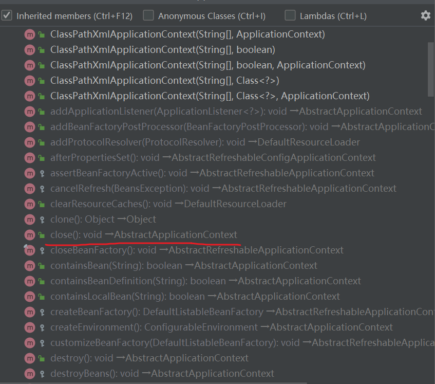
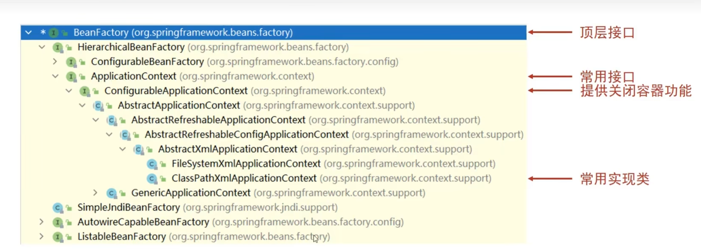

# SSM学习笔记

## Day1

### xml中bean的配置

```xml
<bean id="bookDao" class="com.itheima.dao.impl.BookDaoImpl"/>
<bean id="bookService" class="com.itheima.service.impl.BookServiceImpl">
        <!--7.配置server与dao的关系-->
        <!--property标签表示配置当前bean的属性
        name属性表示配置哪一个具体的属性
        ref属性表示参照哪一个bean-->
        <property name="bookDao" ref="bookDao"/>
    </bean>
```

name是service中定义的那个bookDao属性，ref是上面定义的bookDao的bean

```xml
<!--scope：为bean设置作用范围，可选值为单例singleton，非单例prototype-->
    <bean id="bookDao" name="dao" class="com.itheima.dao.impl.BookDaoImpl" scope="prototype"/>
```

singleton是单例，创建出来的Dao对象都是同一个地址

### 为什么bean默认是单例？

spring容器适合管理那些可以复用的对象，比如Dao, ServiceImpl。耳封装实体数据的域对象不适合交给容器管理。

### 创建bean的三种方法

#### 实例化

```xml
<bean id="bookDao" class="com.itheima.dao.impl.BookDaoImpl"/>
```

spring创建bean调用的是无参的构造函数，是通过反射机制来调用的。

#### 静态工厂

```xml
<bean id="orderDao" class="com.itheima.factory.OrderDaoFactory" factory-method="getOrderDao"/>
```

要指定工厂方法

#### 实例工厂

```xml
<bean id="userFactory" class="com.itheima.factory.UserDaoFactory"/>

 <bean id="userDao" factory-method="getUserDao" factory-bean="userFactory"/>
```

先写实例工厂的bean，然后再写用哪个工厂的哪个工厂方法创建bean

但是这样很麻烦，所以可以直接创建FactoryBean

```java
public class UserDaoFactoryBean implements FactoryBean<UserDao> {
    //代替原始实例工厂中创建对象的方法
    public UserDao getObject() throws Exception {
        return new UserDaoImpl();
    }

    public Class<?> getObjectType() {
        return UserDao.class;
    }

}
```

```xml
<bean id="userDao" class="com.itheima.factory.UserDaoFactoryBean"/>
```

相当于原本由Dao自己创建变成工厂创建了

这样默认创建单例对象，如果创建非单例，需要覆盖方法

```java
public boolean isSingleton() {
    return false;
}
```

alt+insert生成override方法就行

### bean的生命周期

```xml
<bean id="bookDao" class="com.itheima.dao.impl.BookDaoImpl" init-method="init" destroy-method="destory"/>
```

在配置文件中指明初始方法和销毁方法。

或者直接让bean实现InitializingBean, DisposableBean这俩接口，对应方法如下

```java
public class BookServiceImpl implements BookService, InitializingBean, DisposableBean {
    private BookDao bookDao;

    public void setBookDao(BookDao bookDao) {
        System.out.println("set .....");
        this.bookDao = bookDao;
    }

    public void save() {
        System.out.println("book service save ...");
        bookDao.save();
    }

    public void destroy() throws Exception {
        System.out.println("service destroy");
    }

    public void afterPropertiesSet() throws Exception {
        System.out.println("service init");
    }
}
```

```java
public class AppForLifeCycle {
    public static void main( String[] args ) {
        ClassPathXmlApplicationContext ctx = new ClassPathXmlApplicationContext("applicationContext.xml");
        BookDao bookDao = (BookDao) ctx.getBean("bookDao");
        bookDao.save();
    }
}
```

需要注意的是，在这样的main中，如果直接运行，是无法触发销毁函数的，因为IoC容器运行在java虚拟机中，执行到最后就退出了。如果需要调用销毁函数，需要显式地关闭容器。

```java
public class AppForLifeCycle {
    public static void main( String[] args ) {
        ClassPathXmlApplicationContext ctx = new ClassPathXmlApplicationContext("applicationContext.xml");

        BookDao bookDao = (BookDao) ctx.getBean("bookDao");
        bookDao.save();
        //注册关闭钩子函数，在虚拟机退出之前回调此函数，关闭容器
        //ctx.registerShutdownHook();
        //关闭容器
        ctx.close();
    }
}
```

close()这个方法在ApplicationContext接口中并没有定义（Ctrl+H查看）



在AbstractApplicationContext这个抽象类中才有定义，因此，如果需要使用close()方法，ctx对象类型需要指定为ClassPathXmlApplicationContext

值得注意的是，close()方法比较暴力，可以使用钩子函数去关闭

```java
ctx.registerShutdownHook();
```

钩子函数地位置比较随意，目的是告诉虚拟机在退出之前关闭容器，耳close之后容器就不生效了

上述程序地运行结果为

```
init... //Dao对象初始化
set ..... //Service对象进行赋值
service init //Service对象进行初始化
book dao save ... //Dao对象调用方法
service destroy //关闭容器，销毁service对象
destory... //销毁Dao对象
```

事实上，在配置中指定了容器中有哪些bean之后，无论是否显式的获取bean，bean都会被初始化，容器关闭前bean会被销毁

### DI的四种方式

#### setter注入

分为引用类型（对象）和简单类型（int String等）

```xml
<bean id="bookDao" class="com.itheima.dao.impl.BookDaoImpl">
    <!--property标签：设置注入属性-->
    <!--name属性：设置注入的属性名，实际是set方法对应的名称-->
    <!--value属性：设置注入简单类型数据值-->
    <property name="connectionNum" value="100"/>
    <property name="databaseName" value="mysql"/>
</bean>

<bean id="userDao" class="com.itheima.dao.impl.UserDaoImpl"/>

<!--注入引用类型-->
<bean id="bookService" class="com.itheima.service.impl.BookServiceImpl">
    <!--property标签：设置注入属性-->
    <!--name属性：设置注入的属性名，实际是set方法对应的名称-->
    <!--ref属性：设置注入引用类型bean的id或name-->
    <property name="bookDao" ref="bookDao"/>
    <property name="userDao" ref="userDao"/>
</bean>
```

都需要在bean中定义类型属性并提供可访问的setter方法

#### 构造器注入

```Java
public class BookDaoImpl implements BookDao {
    private String databaseName;
    private int connectionNum;

    public BookDaoImpl(String databaseName, int connectionNum) {
        this.databaseName = databaseName;
        this.connectionNum = connectionNum;
    }

    public void save() {
        System.out.println("book dao save ..."+databaseName+","+connectionNum);
    }
}
```

```xml
<bean id="bookDao" class="com.itheima.dao.impl.BookDaoImpl">
    <!--根据构造方法参数位置注入-->
    <constructor-arg index="0" value="mysql"/>
    <constructor-arg index="1" value="100"/>
</bean>

```

```java
public class BookServiceImpl implements BookService{
    private BookDao bookDao;
    private UserDao userDao;

    public BookServiceImpl(BookDao bookDao, UserDao userDao) {
        this.bookDao = bookDao;
        this.userDao = userDao;
    }

    public void save() {
        System.out.println("book service save ...");
        bookDao.save();
        userDao.save();
    }
}
```

```xml
<bean id="bookService" class="com.itheima.service.impl.BookServiceImpl">
    <constructor-arg name="userDao" ref="userDao"/>
    <constructor-arg name="bookDao" ref="bookDao"/>
</bean>
```

把原本setter干的事交给constructor，同时在xml中注明

name是构造方法中形参的名字，ref是xml中上下文中bean的名字

#### 两种注入方式的选择

对于强制依赖，使用构造器注入，使用setter注入有概率不进行注入导致报空指针

可选注入使用setter注入，较为灵活

第三方框架大部分使用构造器注入

#### 自动装配

```xml
<bean id="bookService" class="com.itheima.service.impl.BookServiceImpl" autowire="byType"/>
```

按类型自动装配要求被装配的属性在上下文中必须是唯一的，比如上下文中不能有bookDao1,bookDao2

第二种是byName，要求带装配的属性名与上下文中的bean名称一样

自动装配只能用于引用类型DI，简单类型不可以。

自动装配优先级低于setter和构造器注入

#### 集合装配

```java
public class BookDaoImpl implements BookDao {

    private int[] array;

    private List<String> list;

    private Set<String> set;

    private Map<String,String> map;

    private Properties properties;

}
```

```xml
<bean id="bookDao" class="com.itheima.dao.impl.BookDaoImpl">
    <!--数组注入-->
    <property name="array">
        <array>
            <value>100</value>
            <value>200</value>
            <value>300</value>
        </array>
    </property>
    <!--list集合注入-->
    <property name="list">
        <list>
            <value>itcast</value>
            <value>itheima</value>
            <value>boxuegu</value>
            <value>chuanzhihui</value>
        </list>
    </property>
    <!--set集合注入-->
    <property name="set">
        <set>
            <value>itcast</value>
            <value>itheima</value>
            <value>boxuegu</value>
            <value>boxuegu</value>
        </set>
    </property>
    <!--map集合注入-->
    <property name="map">
        <map>
            <entry key="country" value="china"/>
            <entry key="province" value="henan"/>
            <entry key="city" value="kaifeng"/>
        </map>
    </property>
    <!--Properties注入-->
    <property name="properties">
        <props>
            <prop key="country">china</prop>
            <prop key="province">henan</prop>
            <prop key="city">kaifeng</prop>
        </props>
    </property>
</bean>
```

## Day2

### 如何加载properties文件？

#### 开启context命名空间

```xml
<beans xmlns="http://www.springframework.org/schema/beans"
       xmlns:xsi="http://www.w3.org/2001/XMLSchema-instance"
       xmlns:context="http://www.springframework.org/schema/context"//new
       xsi:schemaLocation="
            http://www.springframework.org/schema/beans
            http://www.springframework.org/schema/beans/spring-beans.xsd
            http://www.springframework.org/schema/context                     //new
            http://www.springframework.org/schema/context/spring-context.xsd  //new
            ">
```

第三行的context代表context命名空间，之后两行新的复制出来的结果就是把bean换成context

#### 使用context空间加载properties文件

```xml
<context:property-placeholder location="jdbc.properties" system-properties-mode="NEVER"/>
```

system-properties-mode代表不加载系统的环境变量，系统环境变量优先级大于配置文件

如果有多个properties文件要加载，写成如下格式

```xml
<context:property-placeholder location="classpath*:*.properties" system-properties-mode="NEVER"/>
```

第二个*可以加载当前工程中所有的properties文件，第一个 *可以加载所有的properties文件（比如jar包里的）

#### 使用属性占位符${}读取properties文件中的属性

```xml
<bean class="com.alibaba.druid.pool.DruidDataSource">
    <property name="driverClassName" value="${jdbc.driver}"/>
    <property name="url" value="${jdbc.url}"/>
    <property name="username" value="${jdbc.username}"/>
    <property name="password" value="${jdbc.password}"/>
</bean>
```

### 如何加载配置文件？

```java
//1.加载类路径下的配置文件
ApplicationContext ctx = new ClassPathXmlApplicationContext("applicationContext.xml");
//2.从文件系统下加载配置文件
ApplicationContext ctx = new FileSystemXmlApplicationContext("D:\\workspace\\spring\\spring_10_container\\src\\main\\resources\\applicationContext.xml");

```

如果加载多个配置文件，直接，加配置名就可以了

### 三种不同的获取bean的方式

```java
BookDao bookDao = (BookDao) ctx.getBean("bookDao");//强转
BookDao bookDao = ctx.getBean("bookDao",BookDao.class);//将类指定
BookDao bookDao = ctx.getBean(BookDao.class);//按bean类型获取，这种方式要求ctx中只有这一个类型的bean
```

### BeanFactory（过时）

spring早期加载bean的方式，与applicationContext不同的是，beanfactory是延迟加载bean，applicationContext是容器启动就加载bean，如果想让ctx也延迟加载，可以加上如下参数

```xml
<bean id="bookDao" class="com.itheima.dao.impl.BookDaoImpl" lazy-init="true"/>
```



### 总结

#### bean相关


#### 依赖注入相关


### 注解开发定义bean

```java
//@Component定义bean
@Component("bookDao")//括号里的就是id
public class BookDaoImpl implements BookDao {
    public void save() {
        System.out.println("book dao save ...");
    }
}
```

```xml
<context:component-scan base-package="com.itheima"/>
```

spring有三个衍生注解，与component作用相同，用于区分业务层数据层和表现层

```java
@Repository("bookController")
@Service("bookService")
@Controller("bookController")
```

### 纯注解开发模式

```java
package com.itheima.config;

import org.springframework.context.annotation.ComponentScan;
import org.springframework.context.annotation.Configuration;

//声明当前类为Spring配置类
@Configuration
//设置bean扫描路径，多个路径书写为字符串数组格式
@ComponentScan({"com.itheima.service","com.itheima.dao"})
public class SpringConfig {
}
```

作用相当于原本的applicationContext.xml文件

```java
public class AppForAnnotation {
    public static void main(String[] args) {
        //AnnotationConfigApplicationContext加载Spring配置类初始化Spring容器
        ApplicationContext ctx = new AnnotationConfigApplicationContext(SpringConfig.class);
        BookDao bookDao = (BookDao) ctx.getBean("bookDao");
        System.out.println(bookDao);
        //按类型获取bean
        BookService bookService = ctx.getBean(BookService.class);
        System.out.println(bookService);
    }
}
```

### 注解控制bean控制范围与生命周期

```java
@Repository
//@Scope设置bean的作用范围
@Scope("singleton")
public class BookDaoImpl implements BookDao {

    public void save() {
        System.out.println("book dao save ...");
    }
    //@PostConstruct设置bean的初始化方法，运行于构造方法后
    @PostConstruct
    public void init() {
        System.out.println("init ...");
    }
    //@PreDestroy设置bean的销毁方法，运行于销毁前
    @PreDestroy
    public void destroy() {
        System.out.println("destroy ...");
    }

}
```

### 注解依赖注入

```java
@Service
public class BookServiceImpl implements BookService {
    //@Autowired：注入引用类型
    @Autowired
    //@Qualifier：自动装配bean时按bean名称装配，用于有多个dao对象的情况
    @Qualifier("bookDao")
    private BookDao bookDao;

    public void save() {
        System.out.println("book service save ...");
        bookDao.save();
    }
}
```

自动装配基于反射设计创建对象，暴力反射对应属性为私有属性初始化数值，无需提供setter方法

自动装配建议使用无参构造方法创建对象，如果不提供对应构造方法，确保构造方法唯一

### 简单类型注入

```java
@Repository("bookDao")
public class BookDaoImpl implements BookDao {
    //@Value：注入简单类型（无需提供set方法）
    @Value("${name}")
    private String name;

    public void save() {
        System.out.println("book dao save ..." + name);
    }
}
```

```java
@Configuration
@ComponentScan("com.itheima")
//@PropertySource加载properties配置文件
@PropertySource({"jdbc.properties"})
public class SpringConfig {
}
```

如果想从properties文件中加载值，则需要在config类中指定properties路径

与xml不同的是，@PropertySource不支持通配符，因此classpath* :*.properties非法，只能写classpath:jdbc.properties

### 管理第三方bean

```java
@Configuration
@ComponentScan("com.itheima")
//@Import:导入配置信息
@Import({JdbcConfig.class})
public class SpringConfig {
}
```

```java
public class JdbcConfig {
    //1.定义一个方法获得要管理的对象
    @Value("com.mysql.jdbc.Driver")
    private String driver;
    @Value("jdbc:mysql://localhost:3306/spring_db")
    private String url;
    @Value("root")
    private String userName;
    @Value("root")
    private String password;
    //2.添加@Bean，表示当前方法的返回值是一个bean
    //@Bean修饰的方法，形参根据类型自动装配
    @Bean
    public DataSource dataSource(BookDao bookDao){
        System.out.println(bookDao);
        DruidDataSource ds = new DruidDataSource();
        ds.setDriverClassName(driver);
        ds.setUrl(url);
        ds.setUsername(userName);
        ds.setPassword(password);
        return ds;
    }
}
```

比如这里要管理第三方的druiddatasource，把它写到JdbcConfig里，写一个管理这个bean的方法加上@Bean注解，然后在SpringConfig中import

简单类型注入用@Value，引用类型直接根据形参按类型注入

### Spring整合Mybatis

```xml
<properties resource="jdbc.properties"></properties>
<typeAliases>
    <package name="com.itheima.domain"/>
</typeAliases>
<environments default="mysql">
    <environment id="mysql">
        <transactionManager type="JDBC"></transactionManager>
        <dataSource type="POOLED">
            <property name="driver" value="${jdbc.driver}"></property>
            <property name="url" value="${jdbc.url}"></property>
            <property name="username" value="${jdbc.username}"></property>
            <property name="password" value="${jdbc.password}"></property>
        </dataSource>
    </environment>
</environments>
<mappers>
    <package name="com.itheima.dao"></package>
</mappers>
```

```java
public static void main(String[] args) throws IOException {
    // 1. 创建SqlSessionFactoryBuilder对象
    SqlSessionFactoryBuilder sqlSessionFactoryBuilder = new SqlSessionFactoryBuilder();
    // 2. 加载SqlMapConfig.xml配置文件
    InputStream inputStream = Resources.getResourceAsStream("SqlMapConfig.xml.bak");
    // 3. 创建SqlSessionFactory对象
    SqlSessionFactory sqlSessionFactory = sqlSessionFactoryBuilder.build(inputStream);
    // 4. 获取SqlSession
    SqlSession sqlSession = sqlSessionFactory.openSession();
    // 5. 执行SqlSession对象执行查询，获取结果User
    AccountDao accountDao = sqlSession.getMapper(AccountDao.class);

    Account ac = accountDao.findById(2);
    System.out.println(ac);

    // 6. 释放资源
    sqlSession.close();
}
```

观察原本的config与main，根据每一项来编写MyBatisConfig。我们需要的是SqlSessionFactoryBuilder,所以针对这个类创建bean管理

```java
public class MybatisConfig {
    //定义bean，SqlSessionFactoryBean，用于产生SqlSessionFactory对象
    @Bean
    public SqlSessionFactoryBean sqlSessionFactory(DataSource dataSource){
        SqlSessionFactoryBean ssfb = new SqlSessionFactoryBean();
        ssfb.setTypeAliasesPackage("com.itheima.domain");
        ssfb.setDataSource(dataSource);
        return ssfb;
    }
    //定义bean，返回MapperScannerConfigurer对象
    @Bean
    public MapperScannerConfigurer mapperScannerConfigurer(){
        MapperScannerConfigurer msc = new MapperScannerConfigurer();
        msc.setBasePackage("com.itheima.dao");
        return msc;
    }
}
```

```java
public static void main(String[] args) {
    ApplicationContext ctx = new AnnotationConfigApplicationContext(SpringConfig.class);

    AccountService accountService = ctx.getBean(AccountService.class);

    Account ac = accountService.findById(1);
    System.out.println(ac);
}
```

### Spring整合JUnit

```java
@RunWith(SpringJUnit4ClassRunner.class)
//设置Spring环境对应的配置类
@ContextConfiguration(classes = SpringConfig.class)
public class AccountServiceTest {
    //支持自动装配注入bean
    @Autowired
    private AccountService accountService;

    @Test
    public void testFindById(){
        System.out.println(accountService.findById(1));

    }

    @Test
    public void testFindAll(){
        System.out.println(accountService.findAll());
    }


}
```

指定运行器和运行上下文，这两个都是固定的